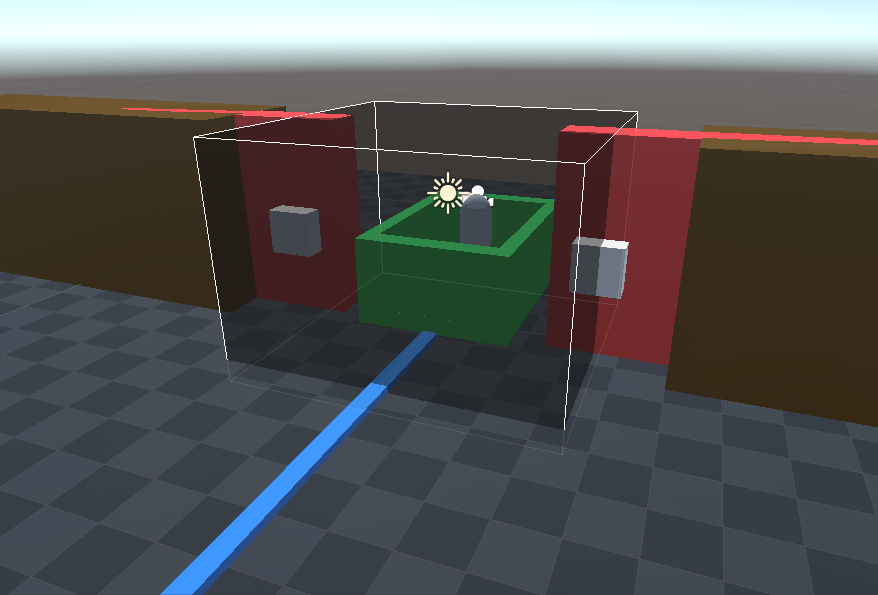
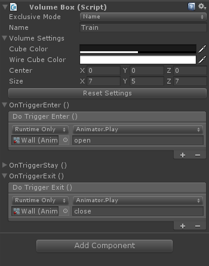

# VolumeBox

It's a very simple and basic asset to create a dynamic TriggerBox.

With this asset you can create effect areas where callbacks will be called when you enter, stay and exit.
Contains a demonstration scenes to learn how to use.
Use as a tween, easy as the UI elements. Create trigger areas quickly.

✔️ TriggerBox set color.
✔️ Extremely easy to use.
✔️ Uses UnityEvent.
✔️ Center and size.

### ⭐ Events ⭐

	- OnTriggerEnter (Once).
	- OnTriggerStay (Loop).
	- OnTriggerExit (Once).

	
	

